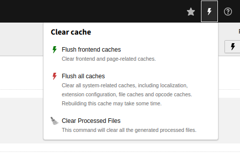

# TYPO3 Extension `wit_cleartempfiles`

The [WOIT] Clear Processed Files Extension is a powerful tool designed to simplify file management tasks within your TYPO3 environment. This extension automates the process of clearing processed files from the fileadmin directory, ensuring your TYPO3 instance remains organized and optimized.

## Installation

Install the extension via Composer using the following composer name: `composer req woit/wit-cleartempfiles` 

## Features
- Efficiently clears processed files within the fileadmin directory.
- Streamlines file management tasks, saving time and effort.
- Easy-to-use interface for hassle-free operation.
- Enhances TYPO3 performance by maintaining a clutter-free environment.
- Compatible with TYPO3 versions 11 & 12.

## Usage

1. Navigate to the TYPO3 backend.
2. Access the Clear Processed Files extension from the extension menu or directly from the Clear Caches dropdown in the navbar.
3. Follow the on-screen instructions to clear processed files.
4. Confirm the action when prompted.
5. Enjoy a clutter-free fileadmin directory!

## Contribution
Contributions to this TYPO3 extension are welcome! If you encounter any issues, have suggestions for improvements, or would like to contribute code, please feel free to open an issue or submit a pull request.

## Support
For any questions or support requests, please contact info@webofficeit.com.